# Health Agent Bridge

Puente local para llevar datos de smartwatch/telefono hacia workspaces de agentes
Hermes/OpenClaw sin exponer biometria sensible a servicios externos.

El MVP parte desde payloads JSON simulados o exportados. Para iPhone + Xiaomi
Smart Band, la ruta recomendada es:

```mermaid
flowchart LR
    Band["Xiaomi Smart Band"] --> MiFitness["Mi Fitness"]
    MiFitness --> AppleHealth["Apple Health"]
    AppleHealth --> Export["Health export XML/JSON"]
    Export --> Api["FastAPI local"]
    Api --> Db["SQLite"]
    Db --> Summary["Daily summary service"]
    Summary --> Workspace["agent-workspace/context"]
    Workspace --> Agents["Hermes / OpenClaw"]
```



## MVP

- `POST /health/import`: importa metricas diarias, sueno, frecuencia cardiaca,
  actividad y notas.
- `GET /health/summary/today`: genera resumen del dia y lo escribe para agentes.
- SQLite local, sin servicios externos.
- Autenticacion simple por API key local.
- Salida Markdown/JSON en `agent-workspace/context`.

## Setup

```powershell
py -3.12 -m venv .venv
.\.venv\Scripts\pip install -r requirements.txt
Copy-Item .env.example .env
.\.venv\Scripts\uvicorn health_agent_bridge.main:app --reload --app-dir src
```

Importar ejemplo:

```powershell
$headers = @{ "X-API-Key" = "change-me-local-only" }
$body = Get-Content -Raw .\examples\health-import.sample.json
Invoke-RestMethod -Method Post -Uri http://127.0.0.1:8000/health/import `
  -Headers $headers -Body $body -ContentType "application/json"
Invoke-RestMethod -Method Get -Uri http://127.0.0.1:8000/health/summary/today `
  -Headers $headers
```

## Workspace Output

- `agent-workspace/context/health_today.md`
- `agent-workspace/context/health_alerts.json`
- `agent-workspace/context/reminders.json`

## Medical Boundary

Este proyecto no diagnostica enfermedades. Solo resume tendencias de habitos y
sugiere acciones conservadoras como descanso, caminata suave, hidratacion o
consultar a un profesional si un patron preocupante se repite.
